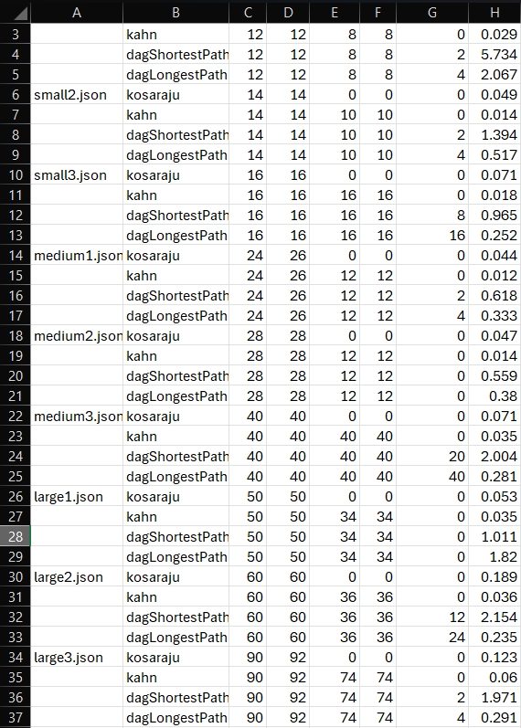

# **Assignment 4 — Smart City / Smart Campus Scheduling**

## Usage

1. Place input files in the `/data/` directory.
2. Run the pipeline:

   ```bash
   java -jar target/assignment4-1.0.jar data/small1.json
   ```
3. The program outputs:

   * SCCs and their sizes
   * Condensation DAG summary
   * Topological order
   * Shortest and longest paths
   * Critical path

To run tests:

```bash
mvn test
```

## Implemented Algorithms

* **Kosaraju’s Algorithm** — detects strongly connected components and builds the condensation DAG.
* **Kahn’s Algorithm** — computes a topological order of the condensation DAG.
* **DAG Shortest and Longest Paths** — finds both single-source shortest paths and longest (critical) paths.

## Data summary
### Weight Model

The project uses the **edge-weight model**, where each edge stores its own weight (`w`).
Node-duration models were not used.
Edge weights represent task durations or dependency costs.

### Datasets

Nine datasets are stored under `/data/`:

* **Small (6–10 nodes):** simple graphs, 1–2 cycles or pure DAGs.
* **Medium (10–20 nodes):** mixed structures with several SCCs.
* **Large (20–50 nodes):** for performance and timing tests.

## Results



## Analysis


- All algorithms run in O(V + E) time.
- Kosaraju scales linearly with edges. Dense graphs increase DFS traversals and time. Large SCCs add recursion depth but reduce DAG size.
- Kahn is the fastest algorithm overall. Graph density has minimal impact; runtime depends mainly on number of vertices.
- DAG shortest/longest paths perform nearly equally and reveal scheduling bottlenecks (critical paths). More edges = more relaxations = higher time.

## Conclusions

- This project presents an integrated approach to analyzing and optimizing task dependencies in Smart City scheduling systems.
- By combining strongly connected component detection, topological sorting, and shortest/longest path computation, it transforms complex cyclic dependency graphs into efficient, acyclic schedules.
- The system achieves linear-time performance, accurately identifies critical paths, and provides a practical framework for planning, prioritization, and performance evaluation in large-scale task networks.